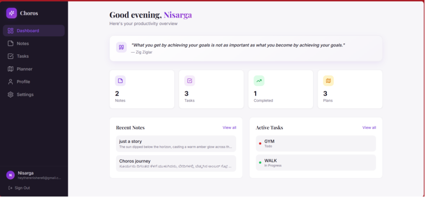
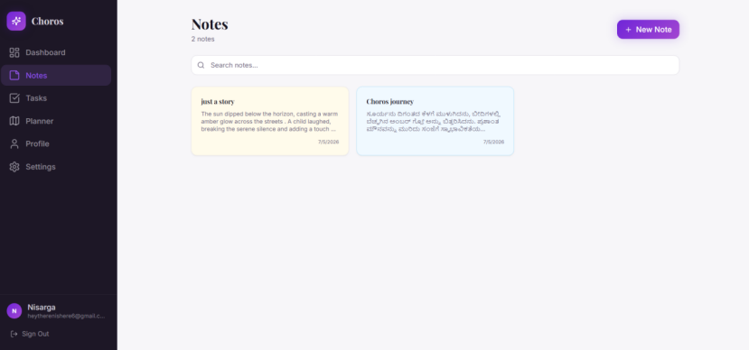
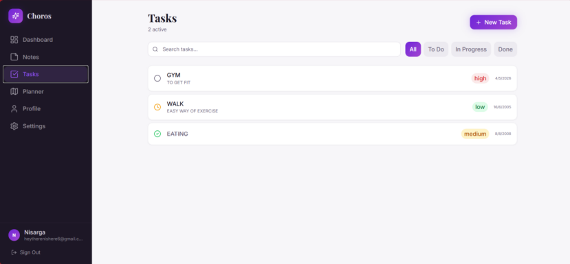
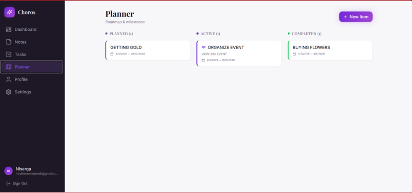
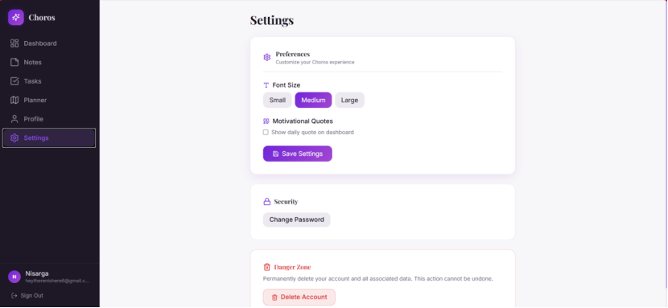

# 📝 Choros - Productivity Management Desktop App

<div align="center">

A powerful, modern desktop application for managing your tasks, notes, and schedule efficiently. Built with **Tauri**, **React**, and **Rust** for optimal performance and security.


</div>

---

## 🎯 Overview

**Choros** is a comprehensive productivity suite designed to help you organize your daily tasks, manage notes, plan your schedule, and track your progress. It combines the power of a native desktop application with the flexibility of a modern web framework.

---

## ✨ Key Features

### 📊 Dashboard
- **Quick Overview**: Get a snapshot of your tasks, notes, and upcoming events
- **Statistics**: Track your productivity metrics and progress
- **Customizable Widgets**: Arrange widgets to suit your workflow

### 📝 Notes Management
- **Rich Text Editor**: Create and edit notes with ease
- **Smart Features**:
  - 🔍 **Summarize**: Automatically extract key points from your notes
  - 🌐 **Translate**: Translate notes to 10+ languages (Spanish, French, German, Italian, Portuguese, Japanese, Chinese, Korean, Russian, Arabic)
  - 🏷️ **Tags & Categories**: Organize notes with custom tags
  - 🔎 **Full-Text Search**: Quickly find notes by content
- **Real-time Sync**: Changes are saved instantly

### ✅ Task Management
- **Flexible Task Creation**: Create tasks with priority levels and due dates
- **Status Tracking**: Mark tasks as todo, in-progress, or completed
- **Recurring Tasks**: Set up tasks that repeat automatically
- **Task Analytics**: Visualize your task completion rates

### 📅 Planner
- **Calendar View**: Visual representation of your schedule
- **Event Management**: Create and manage events
- **Time Blocking**: Schedule focused work sessions
- **Reminders**: Get notified about upcoming events

### 👤 User Management
- **Secure Authentication**: OTP-based login system
- **User Profile**: Customize your personal information
- **Change Password**: Secure password management
- **Account Settings**: Control application preferences

### 🔐 Security
- **Secure Authentication**: One-Time Password (OTP) verification
- **Local Database**: SQLite database for data privacy
- **Encrypted Communication**: Secure data transmission

---

## 🛠️ Tech Stack

### Frontend
- **React** 18.3 - Modern UI framework
- **TypeScript** - Type-safe development
- **Vite** - Lightning-fast build tool
- **Tailwind CSS** - Utility-first CSS framework
- **shadcn/ui** - High-quality component library
- **Radix UI** - Accessible component primitives
- **React Query** - Data fetching and caching
- **React Hook Form** - Efficient form management
- **Lucide React** - Beautiful icon library
- **Framer Motion** - Animation library
- **GSAP** - Advanced animations

### Backend & Desktop
- **Tauri 2** - Desktop application framework
- **Rust** - High-performance system layer
- **Tokio** - Asynchronous runtime
- **SQLite (Rusqlite)** - Lightweight database
- **Reqwest** - HTTP client for API calls

### Development
- **ESLint** - Code linting
- **Vitest** - Unit testing framework
- **Bun** - Fast JavaScript runtime

### Environment & Database
- **Python** - Backend scripting support
- **SQLite** - Local data persistence

---

## 📸 Screenshots

### Dashboard

*Main dashboard with task overview and statistics*

### Notes Editor

*Rich text editor with summarize and translate features*

### Task Management

*Comprehensive task management interface*

### Calendar/Planner

*Calendar view with event scheduling*

### Settings

*User preferences and application settings*

---

## 🚀 Getting Started

### Prerequisites
- **Node.js** 16+ (or Bun)
- **Rust** 1.70+ (for Tauri)
- **Python** 3.8+ (for backend scripts)
- **Git**

### Installation

1. **Clone the repository**
   ```bash
   git clone https://github.com/yourusername/choros.git
   cd choros
   ```

2. **Install frontend dependencies**
   ```bash
   # Using npm
   npm install
   
   # Or using Bun (faster)
   bun install
   ```

3. **Install Python dependencies** (if using backend services)
   ```bash
   # Create venv
   python -m venv venv

   # Activate (Windows)
   venv\Scripts\activate

   # Install deps
   pip install -r requirements.txt
   ```

### Development

#### Run Development Server
```bash
# Start the development server
npm run dev

# Or with Tauri dev command
npm run tauri dev
```

#### Build for Production
```bash
# Build frontend and Tauri app
npm run build

# Or development build
npm run build:dev
```

#### Run Tests
```bash
# Run tests once
npm run test

# Run tests in watch mode
npm run test:watch
```

#### Lint Code
```bash
npm run lint
```

---

## 📁 Project Structure

```
choros/
├── src/                      # Frontend source
│   ├── components/          # React components
│   │   ├── ui/             # shadcn/ui components
│   │   ├── AppLayout.tsx    # Main app layout
│   │   └── AppSidebar.tsx   # Navigation sidebar
│   ├── pages/               # Page components
│   │   ├── DashboardPage.tsx
│   │   ├── NotesPage.tsx
│   │   ├── TasksPage.tsx
│   │   ├── PlannerPage.tsx
│   │   ├── ProfilePage.tsx
│   │   ├── SettingsPage.tsx
│   │   └── AuthPage.tsx
│   ├── contexts/            # React context providers
│   │   └── AuthContext.tsx
│   ├── hooks/               # Custom React hooks
│   ├── lib/                 # Utility functions
│   ├── App.tsx              # Main app component
│   └── main.tsx             # Entry point
├── src-tauri/               # Tauri backend (Rust)
│   ├── src/
│   │   ├── main.rs          # Tauri commands
│   │   ├── lib.rs           # Backend logic
│   │   ├── db.rs            # Database operations
│   │   └── models.rs        # Data models
│   ├── tauri.conf.json      # Tauri configuration
│   └── Cargo.toml           # Rust dependencies
├── public/                  # Static assets
├── backend.py               # Python backend (optional)
├── database.py              # Database utilities
├── package.json             # NPM dependencies
├── tsconfig.json            # TypeScript configuration
├── tailwind.config.ts       # Tailwind CSS config
├── vite.config.ts           # Vite configuration
└── vitest.config.ts         # Vitest configuration
```

---

## 🔧 Configuration

### Environment Variables

1. **Copy the example file**:
   ```bash
   cp .env.example .env
   ```

2. **Fill in your credentials** in the `.env` file:
   ```env
   # Email Configuration (Gmail SMTP)
   SMTP_EMAIL=your-email@gmail.com
   SMTP_PASSWORD=your_app_password_here
   
   # API Configuration
   VITE_API_URL=http://localhost:8000
   
   # Tauri Configuration
   TAURI_ENV=development
   
   # Feature Flags
   VITE_ENABLE_TRANSLATIONS=true
   VITE_ENABLE_SUMMARIZATION=true
   ```

### Gmail App Password Setup

For OTP email functionality:

1. Go to [Google Account Security](https://myaccount.google.com/apppasswords)
2. Select **"Mail"** and your device type
3. Google will generate a **16-character app password**
4. Copy it to your `.env` file as `SMTP_PASSWORD`
5. ⚠️ **Never commit `.env` file** - it's in `.gitignore`

### Tauri Configuration

Edit `src-tauri/tauri.conf.json` to customize:
- App window settings
- Menu configuration
- Security policies
- File associations

### Security Notes

- ✅ `.env.example` shows the structure (commit this)
- ❌ `.env` contains real credentials (never commit)
- ❌ Never push passwords or API keys to GitHub
- ✅ Share only `.env.example` with your team

---

## 🎯 Usage Examples

### Creating a Note
1. Navigate to the **Notes** section
2. Click **New Note**
3. Add your content
4. Use **Summarize** to extract key points
5. Use **Translate** to convert to another language
6. Click **Save**

### Managing Tasks
1. Go to **Tasks**
2. Click **Add Task**
3. Set priority, due date, and description
4. Track progress with status indicators
5. View analytics to monitor completion rates

### Planning Your Day
1. Open **Planner**
2. Click on a date to create an event
3. Set time blocks for focused work
4. Enable notifications for reminders

---

## 🤝 Contributing

We welcome contributions! Please follow these steps:

1. Fork the repository
2. Create a feature branch (`git checkout -b feature/amazing-feature`)
3. Commit your changes (`git commit -m 'Add amazing feature'`)
4. Push to the branch (`git push origin feature/amazing-feature`)
5. Open a Pull Request

### Code Standards
- Follow the existing code style
- Write meaningful commit messages
- Add tests for new features
- Update documentation as needed

---

## 🐛 Troubleshooting

### Common Issues

**Tauri build fails**
```bash
# Update Rust
rustup update

# Clean build
cargo clean
npm run build
```

**Node modules issues**
```bash
# Clear cache and reinstall
rm -rf node_modules package-lock.json
npm install
```

**Database locked errors**
```bash
# Restart the application
# Check if multiple instances are running
```

---

## 📝 License

This project is licensed under the MIT License - see the [LICENSE](LICENSE) file for details.

---

## 📧 Support & Contact

- **Issues**: Report bugs via [GitHub Issues](https://github.com/yourusername/choros/issues)
- **Discussions**: Join our [GitHub Discussions](https://github.com/yourusername/choros/discussions)
- **Email**: support@choros.app

---

## 🙏 Acknowledgments

- [Tauri](https://tauri.app/) - Desktop application framework
- [shadcn/ui](https://ui.shadcn.com/) - Beautiful React components
- [Radix UI](https://www.radix-ui.com/) - Accessible component library
- [Tailwind CSS](https://tailwindcss.com/) - Utility-first CSS
- All open-source contributors

---

## 📊 Project Status

- ✅ Core features implemented
- 🔄 Translation API integration (in progress)
- 🔜 Cloud sync support (planned)
- 🔜 Mobile app (planned)
- 🔜 Team collaboration (planned)

---

<div align="center">

**Made with ❤️ by the Choros Team**

[⬆ Back to Top](#-choros---productivity-management-desktop-app)

</div>
